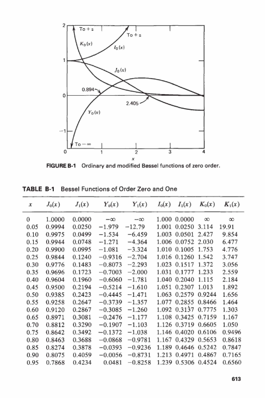
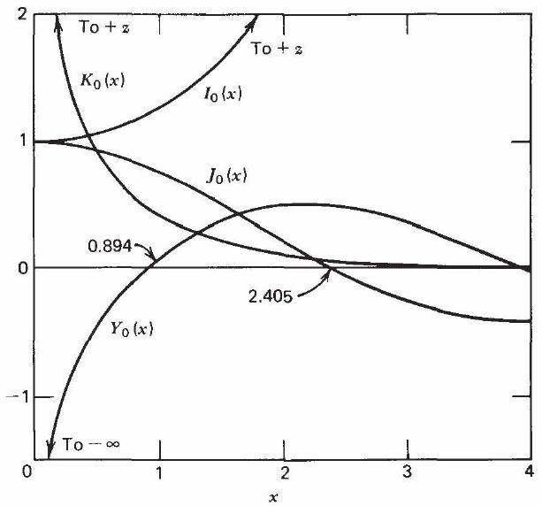

# PDF OCR Processor with Mistral AI

<div align="center">
  
</div>

A Python tool that uses Mistral AI's OCR capabilities to process PDF documents, extract text and images, and save them in an organized structure. This project utilizes Mistral AI's state-of-the-art OCR technology as described in their [official documentation](https://mistral.ai/news/mistral-ocr).

## Features

- Process single PDF files or entire directories
- Extract text and images from PDFs
- Handle large PDFs by automatically splitting them
- Save processed content in an organized folder structure
- Support for retrying failed API calls with exponential backoff

## Prerequisites

- Python 3.7+
- Poppler (for PDF processing)
- Mistral AI API key

### Installing Poppler

#### macOS
```bash
brew install poppler
```

#### Linux
```bash
sudo apt-get install poppler-utils
```

#### Windows
Download from: https://github.com/oschwartz10612/poppler-windows/releases/

## Installation

1. Clone this repository:
```bash
git clone https://github.com/yourusername/pdf-ocr-processor.git
cd pdf-ocr-processor
```

2. Install required Python packages:
```bash
pip install -r requirements.txt
```

3. Set up your Mistral AI API key:
```bash
export MISTRAL_API_KEY="your-api-key-here"
```

## Usage

### Processing a Single PDF
```bash
python mistral_ocr.py path/to/your/document.pdf
```

### Processing a Directory of PDFs
```bash
python mistral_ocr.py path/to/pdf/directory
```

### Output Structure

The processed files will be saved in a directory structure like this:
```
document_name/
├── text/
│   ├── page1.txt
│   ├── page2.txt
│   └── ...
├── images/
│   ├── img-0.jpeg
│   ├── img-1.jpeg
│   └── ...
└── images.json
```

### Example

Here's an example of a PDF page before and after processing:

<div align="center">
  <h4>Original PDF Page</h4>
  
  
  <h4>Extracted Text</h4>
  <pre>
  <code>


FIGURE B-1 Ordinary and modified Bessel functions of zero order.

TABLE B-1 Bessel Functions of Order Zero and One

| $x$ | $J_{0}(x)$ | $J_{1}(x)$ | $Y_{0}(x)$ | $Y_{1}(x)$ | $I_{0}(x)$ | $I_{1}(x)$ | $K_{0}(x)$ | $K_{1}(x)$ |
| :--: | :--: | :--: | :--: | :--: | :--: | :--: | :--: | :--: |
| 0 | 1.0000 | 0.0000 | $-\infty$ | $-\infty$ | 1.000 | 0.0000 | $\infty$ | $\infty$ |
| 0.05 | 0.9994 | 0.0250 | -1.979 | -12.79 | 1.001 | 0.0250 | 3.114 | 19.91 |
| 0.10 | 0.9975 | 0.0499 | -1.534 | -6.459 | 1.003 | 0.0501 | 2.427 | 9.854 |
| 0.15 | 0.9944 | 0.0748 | -1.271 | -4.364 | 1.006 | 0.0752 | 2.030 | 6.477 |
| 0.20 | 0.9900 | 0.0995 | -1.081 | -3.324 | 1.010 | 0.1005 | 1.753 | 4.776 |
| 0.25 | 0.9844 | 0.1240 | -0.9316 | -2.704 | 1.016 | 0.1260 | 1.542 | 3.747 |
| 0.30 | 0.9776 | 0.1483 | -0.8073 | -2.293 | 1.023 | 0.1517 | 1.372 | 3.056 |
| 0.35 | 0.9696 | 0.1723 | -0.7003 | -2.000 | 1.031 | 0.1777 | 1.233 | 2.559 |
| 0.40 | 0.9604 | 0.1960 | -0.6060 | -1.781 | 1.040 | 0.2040 | 1.115 | 2.184 |
| 0.45 | 0.9500 | 0.2194 | -0.5214 | -1.610 | 1.051 | 0.2307 | 1.013 | 1.892 |
| 0.50 | 0.9385 | 0.2423 | -0.4445 | -1.471 | 1.063 | 0.2579 | 0.9244 | 1.656 |
| 0.55 | 0.9258 | 0.2647 | -0.3739 | -1.357 | 1.077 | 0.2855 | 0.8466 | 1.464 |
| 0.60 | 0.9120 | 0.2867 | -0.3085 | -1.260 | 1.092 | 0.3137 | 0.7775 | 1.303 |
| 0.65 | 0.8971 | 0.3081 | -0.2476 | -1.177 | 1.108 | 0.3425 | 0.7159 | 1.167 |
| 0.70 | 0.8812 | 0.3290 | -0.1907 | -1.103 | 1.126 | 0.3719 | 0.6605 | 1.050 |
| 0.75 | 0.8642 | 0.3492 | -0.1372 | -1.038 | 1.146 | 0.4020 | 0.6106 | 0.9496 |
| 0.80 | 0.8463 | 0.3688 | -0.0868 | -0.9781 | 1.167 | 0.4329 | 0.5653 | 0.8618 |
| 0.85 | 0.8274 | 0.3878 | -0.0393 | -0.9236 | 1.189 | 0.4646 | 0.5242 | 0.7847 |
| 0.90 | 0.8075 | 0.4059 | -0.0056 | -0.8731 | 1.213 | 0.4971 | 0.4867 | 0.7165 |
| 0.95 | 0.7868 | 0.4234 | 0.0481 | -0.8258 | 1.239 | 0.5306 | 0.4524 | 0.6560 |
  </code>
  </pre>
  
  <h4>Extracted Image</h4>
  
</div>

## Configuration

You can modify the following constants in `mistral_ocr.py`:
- `INITIAL_DELAY`: Initial delay between retries (default: 2 seconds)
- `MAX_DELAY`: Maximum delay between retries (default: 60 seconds)
- `MAX_PAGES_PER_SPLIT`: Maximum pages to process at once (default: 300)
- `MAX_FILE_SIZE_MB`: Maximum file size before splitting (default: 200MB)
- `MAX_PAGES`: Maximum number of pages to process from a PDF (default: 1000)

## License

This project is licensed under the MIT License - see the [LICENSE](LICENSE) file for details.

## Potential Uses

This tool is particularly valuable for several use cases:

- **RAG Systems Integration**: Mistral OCR is an ideal model to use in combination with a RAG (Retrieval-Augmented Generation) system, especially when working with multimodal documents like slides or complex PDFs. The processed content can be used to build more accurate and context-aware AI applications.

- **Document Understanding**: The extracted markdown texts and images can be used for more fine-grained document analysis and understanding. This is particularly useful for:
  - Academic research and paper analysis
  - Legal document processing
  - Technical documentation management
  - Business report analysis

- **Cost-Effective Solution**: The Mistral OCR API is currently free to use, making this tool an accessible solution for both individual developers and organizations.

## Contributing

Contributions are welcome! Please feel free to submit a Pull Request. 