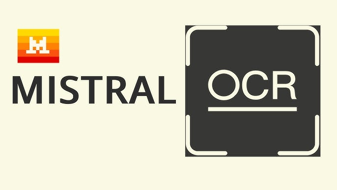

# PDF OCR Processor with Mistral AI

<div align="center">
  
</div>

A Python tool that uses Mistral AI's OCR capabilities to process PDF documents, extract text and images, and save them in an organized structure. This project utilizes Mistral AI's state-of-the-art OCR technology as described in their [official documentation](https://mistral.ai/news/mistral-ocr).

## Features

- Process single PDF files or entire directories
- Extract text and images from PDFs
- Handle large PDFs by automatically splitting them
- Save processed content in an organized folder structure
- Support for retrying failed API calls with exponential backoff

## Prerequisites

- Python 3.7+
- Poppler (for PDF processing)
- Mistral AI API key

### Installing Poppler

#### macOS
```bash
brew install poppler
```

#### Linux
```bash
sudo apt-get install poppler-utils
```

#### Windows
Download from: https://github.com/oschwartz10612/poppler-windows/releases/

## Installation

1. Clone this repository:
```bash
git clone https://github.com/yourusername/pdf-ocr-processor.git
cd pdf-ocr-processor
```

2. Install required Python packages:
```bash
pip install -r requirements.txt
```

3. Set up your Mistral AI API key:
```bash
export MISTRAL_API_KEY="your-api-key-here"
```

## Usage

### Processing a Single PDF
```bash
python mistral_ocr.py path/to/your/document.pdf
```

### Processing a Directory of PDFs
```bash
python mistral_ocr.py path/to/pdf/directory
```

### Output Structure

The processed files will be saved in a directory structure like this:
```
document_name/
├── text/
│   ├── page1.txt
│   ├── page2.txt
│   └── ...
├── images/
│   ├── img-0.jpeg
│   ├── img-1.jpeg
│   └── ...
└── images.json
```

## Configuration

You can modify the following constants in `mistral_ocr.py`:
- `INITIAL_DELAY`: Initial delay between retries (default: 2 seconds)
- `MAX_DELAY`: Maximum delay between retries (default: 60 seconds)
- `MAX_PAGES_PER_SPLIT`: Maximum pages to process at once (default: 300)
- `MAX_FILE_SIZE_MB`: Maximum file size before splitting (default: 200MB)

## License

This project is licensed under the MIT License - see the [LICENSE](LICENSE) file for details.

## Potential Uses

This tool is particularly valuable for several use cases:

- **RAG Systems Integration**: Mistral OCR is an ideal model to use in combination with a RAG (Retrieval-Augmented Generation) system, especially when working with multimodal documents like slides or complex PDFs. The processed content can be used to build more accurate and context-aware AI applications.

- **Document Understanding**: The extracted markdown texts and images can be used for more fine-grained document analysis and understanding. This is particularly useful for:
  - Academic research and paper analysis
  - Legal document processing
  - Technical documentation management
  - Business report analysis

- **Cost-Effective Solution**: The Mistral OCR API is currently free to use, making this tool an accessible solution for both individual developers and organizations.

## Contributing

Contributions are welcome! Please feel free to submit a Pull Request. 